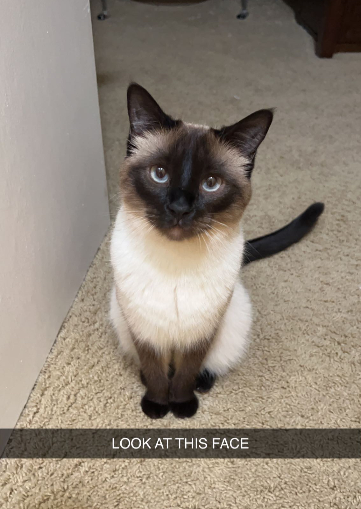

<H1> Quiz 1 </H1>

<H3> Let's get to know me through HTML! </H3>

 Hi my name is <b>Autumn Rosedale</b>! I am currently a junior studying IS+DS and my favorite animal is a cat. For this quiz, I am going to explore HTML and it's various functions while sharing a little bit about myself :) 

<H3> Fun fact table! </H3>

 Within this HTML table I put together, each column represents a <em>topic</em> (drinks, food, my favorite technology tpoic at the moment, and technology topics I would like to learn more about) and each row under represents my <em>top 3 answers</em> in order. 

<table>
  <tr>
    <th> Drinks </th>
    <th> Food </th>
    <th> Places I Want to Visit </th>
    <th> Fav Tech Topics </th>
    <th> Tech Topics to Explore </th>
  </tr>
  <tr>
    <td> Lemon Water </td>
    <td> Sushi </td>
    <td> Ibiza </td>
    <td> Cloud Solutions </td>
    <td> Cybersecurity </td>
  </tr>
  <tr>
    <td> Peach Tea </td>
    <td> Alfredo Pasta </td>
    <td> Thailand </td>
    <td> Machine Learning </td>
    <td> Cyber Threats </td>
  </tr>
   <tr>
    <td> Apple Juice </td>
    <td> Buffalo Chicken Wings </td>
    <td> Italy </td>
    <td> Statistical Analysis </td>
    <td> AI Ethics </td>
  </tr>
</table>

<H3> Meet my cat! </H3>

 This is my cat, her name is <em>Zoë</em> and she's the <b>cutest</b>. 

