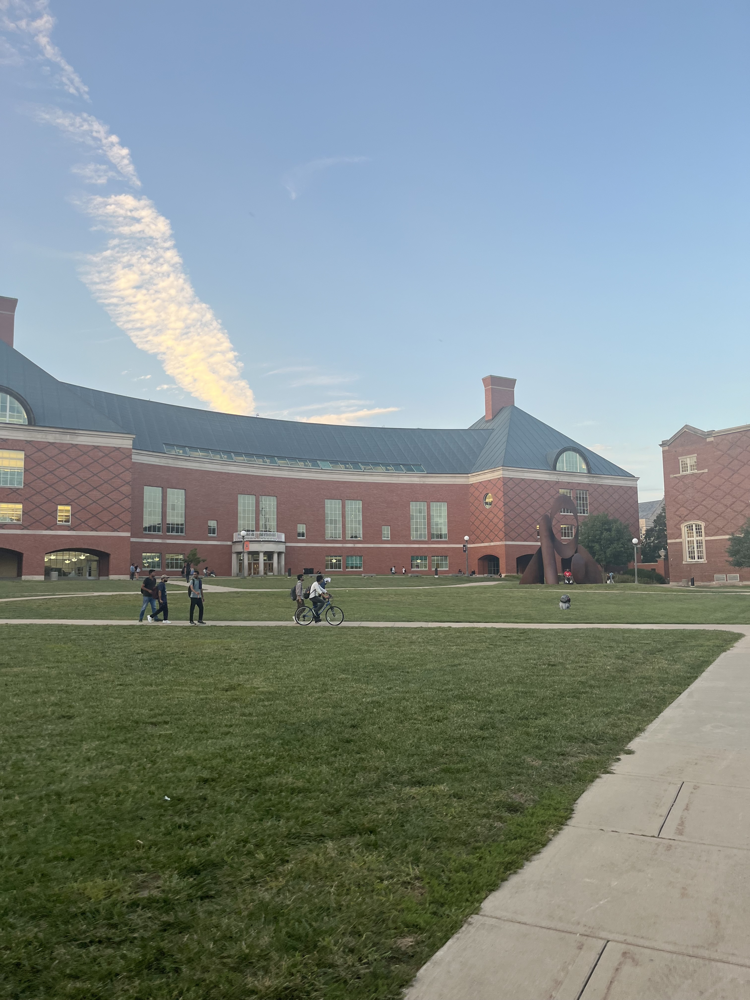

<H1> Fall Semester, 2024</H1>


<H3> Above  is a picture I took of the Grainger Engineering Library at the beginning of the semester!</H3>


Sunsets are **nice** because: 
* The sky can be many different colors, providing a relaxing ambiance
* They change every day, no two sunsets are ever the same
* You learn to appreciate the warmth of the sun during the day

This CSV file contains some facts about the Grainger Engineering Library.

```csv
Built in 1992, Source: UIUC
Largest College Engineering Library in the US, Source: Wikipedia
Named after William Wallace Grainger, Source: CBS News 
Grainger Foundation donated $100 million to UIUC to build the library, Source: UIUC
